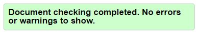
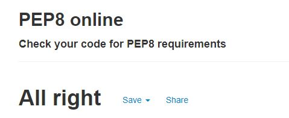
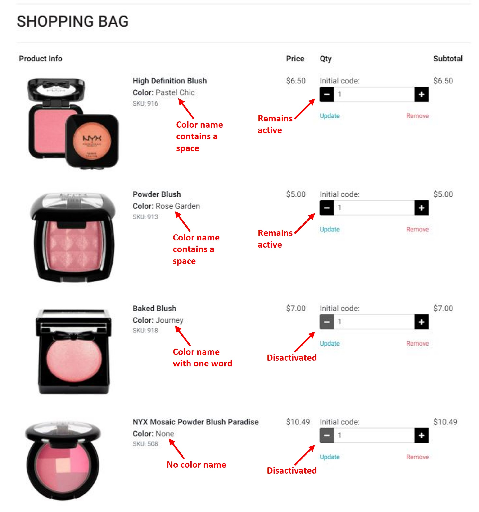

# Victoria's Beauty Website

View the live project [Here](https://)

*Victoria's Beauty* is an e-commerce store that allows to .

The website is designed to be responsive and accessible on a range of devices, making it easy to navigate through.


## User Experience (UX)

### User stories

  - **As a shopper:**

    - I want to view a list of products and select some to purchase.
    - I want to view individual products details and identify the price, description, product rating, product image and available colors. 
    - I want to easily select the color and quantity of a product when purchasing it.

    - I want to view reviews left by other customers for products (to understand whether the product is worth purchasing).
    - I want to leave a review on a product, so that other users may be able to benefit from my opinions on a specific product.
    - I want to be able to edit my reviews (in case I change my opinion).

    - I want to sort the list of available products and easily identify the best rated, best priced, categorically and brand sorted products.
    - I want to sort a specific category of products (to find the best priced or best rated products in a specific category, or sort the products in that category by name or brand).
    
    - I want to search by name, brand or description to find a specific product I would like to purchase.
    - I want to easily see what I have searched for and the number of results.

    - I want to view items in my bag to be purchased.
    - I want to adjust the quantity of individual items in my bag.
    - I want to easily view the total of my purchases at any time to avoid spending too much.

    - I want to easily enter my payment information and check out quickly without hassles.
    - I want to confidently provide my personal and payment information (in a safe and secure manner).
    - I want to view an order confirmation after checkout.
    - I want to create my wishlist (to leave product to purchase later).

  - **As a site user:**
    
    - I want to easily register for an account and be able to view my profile.
    - I want to easily login and logout.
    - I want to easily recover my password in case I forget it.
    - I want to receive a email confirmation after registering to verify that my account registration was successful.
    - I want to view my personal order history and save my payment information. 

  - **As a store Owner:**

    - I want to add new items to my store.
    - I want to edit/update products details.
    - I want to delete items that are no longer fore sale.
      
### Design

  - **Colour Scheme**

    The main colours used are black #000000, white #FFFFFF and red #a50f12.

  - **Typography**

    The Roboto and Playfair Display (used for Logo) fonts are the main fonts used throughout the whole website with Sans Serif and Serif as the fallback fonts in case for any reason the font isn't being imported into the site correctly. Roboto is a clean font used frequently in programming, so it is both attractive and appropriate.

  - **Imagery**
     
    The large background image is striking and catches the user's attention. All other images on the site are the image URLs added by users when creating their recipes.

### Wireframes

  - *Home* page - [View](docs/wireframes/home-page.pdf)

  - *All Products* page - [View](docs/wireframes/all-products-page.pdf)

  - *Product Detail* page - [View](docs/wireframes/product-detail-page.pdf)

  - *My Profile* page - [View](docs/wireframes/my-profile-page.pdf)

  - *Shopping Bag* page - [View](docs/wireframes/shopping-bag-page.pdf)

  - *Wishlist* page - [View](docs/wireframes/wishlist-page.pdf)

  - *Sign In* page - [View](docs/wireframes/sign-in-page.pdf)

  - *Sign Up* page - [View](docs/wireframes/sign-up-page.pdf)

## Features

### Existing Features

- The website is responsive on many device sizes (down to 320 px).

- The website allows users to Create, Read, Update and Delete recipes. This displays full CRUD functionality.

- Any user can:

  - register an account,
  - log in as an existing user,
  - log out,
  - view his profile page with a list of recipes that have been added,
  - view, edit and delete recipes,
  - search recipes,
  - see which user has created any particular recipe.

### Features Left to Implement

- Recipes rating.

- The possibility to leave a comment on a recipe.

- Admin login functionality to edit or delete recipes added by other users (in case of incorrect or inappropriate information). At the moment, the recipes correction of other users are done by accessing the data in MongoDB.

- Advertisement integration (to promote any branded product in the recipes description).

- A *Scroll to top* button.

- *Contact* page.

## Technologies Used

### Languages Used

- HTML5

- CSS3

- Python3

- JavaScript

### Frameworks, Libraries & Programs Used

1. [Django:](https://www.djangoproject.com/)
2. [Django-Allauth:](https://django-allauth.readthedocs.io/en/latest/index.html)

    Allauth was used to handle authentication, registration and account management as well as 3rd party (social) account authentication.

3. Stripe

4. AWS

5. https://temp-mail.org/en/

2. [MongoDB:](https://www.mongodb.com/)

   MongoDB was used to store recipes and users data.

3. [Heroku:](https://id.heroku.com/login)

   Heroku was used to deploy and run the application.
   
4. [Flask:](https://flask.palletsprojects.com/en/2.0.x/)

   Flask was used as a framework to develop a web application.

5. [Jinja:](https://jinja.palletsprojects.com/en/3.0.x/)

   Jinja was used to render templates.

6. [PyMongo:](https://pymongo.readthedocs.io/en/stable/)

   PyMongo was used to work with MongoDB from Python.

7. [Werkzeug:](https://pypi.org/project/Werkzeug/)

   Werkzeug was used to generate and check password hash.

8. [jQuery:](https://jquery.com/)

   jQuery was used in JavaScript codes to add functionality to materialize components.

9. [Git:](https://git-scm.com/)

   Git was used for version control. 

10. [GitPod:](https://www.gitpod.io/)

    GitPod was used as an IDE platform for website realization.

11. [GitHub:](https://github.com/)

    GitHub is used to store the project code after being pushed from GitPod.

12. [Google Fonts:](https://fonts.google.com/)

    Google fonts Roboto, Dancing Script and Courgette were used on all pages throughout the project.

13. [Balsamiq:](https://balsamiq.com/)

    Balsamiq was used to create wireframes during the design process.

14. [Squoosh:](https://squoosh.app/editor)

    Squoosh image editor was used to reduces file size of the images.

15. [Am I responsive?:](http://ami.responsivedesign.is/)

    Am I responsive? was used to show how the website looks on different devices.

16. [Font Awesome:](https://fontawesome.com/)

    Font Awesome was used to add icons.

17. [AutoPrefixer:](https://autoprefixer.github.io/)

    AutoPrefixer was used to add vendor prefixes to a CSS code.

18. [Beautifier:](https://beautifier.io/) 

    Beautifier was used to format code in a consistent and readable way.

19. [W3C Markup Validator](https://validator.w3.org/)

    W3C Markup Validator was used to check the markup validity of Web documents in HTML.

20. [W3C CSS Validator](https://jigsaw.w3.org/css-validator/)
 
    W3C CSS Validator was used to check the markup validity of Web documents in CSS.

21. [JSHint](https://jshint.com/)

    JSHint was used to detect errors and potential problems in JavaScript code.

22. [Chrome DevTools](https://developer.chrome.com/docs/devtools/)

    Chrome DevTools was used to inspect and modify the website code.

23. [PEP8 online](http://pep8online.com/)

    PEP8 online was used to check a code for PEP8 requirements.

24. [Black Playground](https://black.vercel.app/)

    Black Playground was used to format the Python code.

## Testing

The W3C Markup Validator, W3C CSS Validator, JSHint and PEP8 Online services were used to validate HTML, CSS, JS and Python code, respectively, to ensure no syntax error.

- [W3C Markup Validator](https://validator.w3.org/) did not detect any problem in the HTML code on *Home*, *All Recipes*, *Log In* and *Register* pages:

  

- [W3C CSS Validator](https://jigsaw.w3.org/css-validator/) did not detect any problem in the CSS code:

  

- [JSHint](https://jshint.com/) did not detect any problem in the JavaScript code.

- [PEP8 online](http://pep8online.com/) did not detect any problem in the Python code:

  

### Testing User Stories from User Experience (UX) Section

Please see [Here](docs/testing/testing_user_stories.md) the user stories testing with corresponding screenshots.

### Testing Functionality, Usability and Responsiveness

The manual testing is described [Here](manual-testing.md).

### Further Testing

- The Website was tested on Google Chrome, Mozilla Firefox and Microsoft Edge browsers.

- The screen sizes and devices tested in Chrome DevTools include:

    - 1920 x 1080 
    - 1600 x 992
    - 1440 x 900
    - 1366 x 768
    - Nexus 10 (800 x 1280)
    - iPad (768 x 1024)
    - Surface Duo (540 x 720)
    - iPhone 6/7/8 Plus (414 x 736)
    - Pixel 2 (411 x 731)
    - iPhone 6/7/8 (375 x 667)
    - Nexus 4 (384 x 640)
    - iPhone X (375 x 812)
    - Galaxy S5 (360 x 640)
    - iPhone 5/SE (320 x 568)

- Devices physically tested include:

  - Desktop 
  - Laptop
  - iPhoneXR 
  - Huawei Mate 20 
    
### Bugs

#### Fixed bugs

1. On the *Shopping bag* page, disabling +/- buttons outside 1-99 range did not work for products who had color names consisting of more than one word. For example, in the image below, one can notice that all products that have one-word color name (or no colors) have a disactivated minus button when the quantity is equal to 1. While products with color names, consisting of several words with spaces between them, have active minus buttons and can go to negative quantity values.

    

    The problem was solved by [cutting](https://docs.djangoproject.com/en/3.2/ref/templates/builtins/#cut) spaces from color names: by substituting `{{ item.color }}` with `{{ item.color|cut:' ' }}` in quantity-form.html.

2. On the *Product details* page, it was not possible to display icons inside select options tag (it was not possible to use an <i> tag):

    ```
    <option value="{{ color.colour_name }}"><i class='fas fa-square-full'></i> {{ color.colour_name }}"</option>
    ```
    The solution was found [Here](https://stackoverflow.com/questions/48508431/how-to-add-font-awesome-icons-in-select-options).

    I have set the font family on the select to font awesome:
    ```
    select {
      font-family: 'FontAwesome'
    }
    ```
    and used character points for the square icon `&#xf45c;`:
    ```
    <option style="color: {{ color.hex_value }};" value="{{ color.colour_name }}">&#xf45c; {{ color.colour_name }}</option>
    ```

#### Existing bugs

1. 
        
## Deployment

### Forking the GitHub Repository

By forking the GitHub Repository we make a copy of the original repository on our GitHub account to view and/or make changes without affecting the original repository by using the following steps:

1. Log in to GitHub and locate the [GitHub Repository](https://github.com/).
    
2. At the top of the Repository (not top of page) just above the "Settings" Button on the menu, locate the "Fork" Button.

3. You should now have a copy of the original repository in your GitHub account.

### Making a Local Clone

1. Log in to GitHub and locate the [GitHub Repository](https://github.com/).
    
2. Under the repository name, click "Clone or download".
    
3. To clone the repository using HTTPS, under "Clone with HTTPS", copy the link.
    
4. Open Git Bash.
    
5. Change the current working directory to the location where you want the cloned directory to be made.
    
6. Type `git clone`, and then paste the URL you copied in Step 3.

    ```
    $ git clone https://github.com/YOUR-USERNAME/YOUR-REPOSITORY
    ```

7. Press Enter. Your local clone will be created.

   ```
   $ git clone https://github.com/YOUR-USERNAME/YOUR-REPOSITORY
   > Cloning into `CI-Clone`...
   > remote: Counting objects: 10, done.
   > remote: Compressing objects: 100% (8/8), done.
   > remove: Total 10 (delta 1), reused 10 (delta 1)
   > Unpacking objects: 100% (10/10), done.

Click [Here](https://docs.github.com/en/github/creating-cloning-and-archiving-repositories/cloning-a-repository#cloning-a-repository-to-github-desktop) to retrieve pictures for some of the buttons and more detailed explanations of the above process.

### Deployment to Heroku

1. In the terminal:

    - Type `pip3 freeze --local > requirements.txt`. It will update the list of requirements needed to run the application.
    - Type `echo web: python app.py > Procfile` to create the Procfile.
    - In the Procfile add `web: gunicorn msp4.wsgi:application` (check the Procfile to make sure there is no extra line after the first line as this can confuse Heroku).

2. Create application:

    - Create an account at [Heroku.com](https://dashboard.heroku.com).
    - Click on the *New* button.
    - Select *Create new app*.
    - Enter the name of your application.
    - Select your region.

3. Build the database in Postgres:

    - Click the *Resources* tab and type in *Postgres* in the *Add-ons* search bar.
    - Select *Heroku Postgres* and provision a free *Hobby Dev database*.
    - Install two dependencies: `pip3 install dj_database_url` and `pip3 install psycopg2-binary`.
    - Freeze your requirements into requirements.txt.
    - Retrieve the *Database URL* from the hidden *Config Vars* in *Settings*.
    - Paste the *Database URL* in the database path in *settings.py* and removed the local settings.
    - Run migrations to build the database in Postgres.
    - Load fixtures (*categories.json*, *products.json*) with `python3 manage.py loaddata <JSON filename>`.
    - Create a superuser with `python3 manage.py createsuperuser` and follow the instructions in the terminal.
    - Remove the Postgres *Database URL* so it doesn't end up in version control.
    - Type `heroku config:set DISABLE_COLLECTSTATIC=1` in the terminal to stop Heroku collecting the static files.

4. Set up connection to Github Repository:

    - Click the *Deploy* tab and select *GitHub-Connect to GitHub* in the *Deployment method* section.
    - A prompt to find a Github repository to connect to will then be displayed.
    - Enter the repository name and click search.
    - Once the repository name has been found, click *Connect*.

5. Set environment variables:

    - Click the *Setting* tab and then click *Reveal Confid Vars*.
    - Insert your variables:
      - AWS_ACCESS_KEY_ID: obtained from AWS
      - AWS_SECRET_ACCESS_KEY: obtained from AWS
      - DATABASE_URL: created when provisioned Postgres
      - EMAIL_HOST_PASS: obtained from the email provider
      - EMAIL_HOST_USER: host email address
      - SECRET_KEY: obtained from miniwebtool
      - STRIPE_PUBLIC_KEY: obtained from STRIPE
      - STRIPE_SECRET_KEY: obtained from STRIPE
      - STRIPE_WH_SECRET: obtained from STRIPE
      - USE_AWS: True

6. Enable automatic deployment:

    - Click the *Deploy* tab and scroll to the *Automatic deploys* section.
    - Choose the branch you want to deploy from, then click *Enable Automation Deploys*.

7. View your application:

    - You can view the application by clicking on the *Open app* button located at the top right corner.

### AWS

The static css, js and media files are stored in Amazon Web Services (AWS) S3 Bucket.

    - Go to [AWS](aws.amazon.com) and create an account.
    - Search for S3.
    - Create a new bucket with the following settings:

        - An appropriate name
        - Region (closest to you)
        - Uncheck *Block All Public Access* tickbox

    - Click on the *Properties* tab and enable *Static Website Hosting*. This will allow AWS to host static files.
    - Input *index.html* and *error.html* in the appropriate fields and hit save.
    - Click on the *Properties* tab and edit *CORS configuration* to set up the required connection between the Heroku app and the bucket.
    - Click the *Policy* tab and select *Policy Generator* to create a security policy for the bucket:

        - The policy type: *S3 Bucket Policy*
        - the *Action*: *get object*.
        - Copy the *ARN (Amazon Resource Name)* from the bucket and paste it in the *ARN* field.
    
    - Click *Add Statement* and then *Generate Policy*.
    - Copy the generated policy in to the *Bucket Policy Editor*.
    - Add `/*` at the end of the resource key to allow access to all resources in the bucket.
    - Click *Save*.
    - Click the *Access Control* tab and set the list object permission to everyone under the *Public Access* section.
    - Open *Identity Access Management (IAM)* from the service menu.
    - Create a group for your user to belong to.
    - Create an access policy for you the group which gives access to the S3 bucket.
    - Click the *JSON* tab and select *import managed policy*, search for *S3* and select *S3 Full Access Policy*.
    - Create a user, give them programmatic access and attach it to the group.
    - Download the *.csv file that is generated as this contains the keys required to use AWS.
    - Install *boto3* and *django-storages* using `pip3 install` to connect Django to AWS S3.
    - Add the AWS keys to the *Config Vars* in *Settings* tab in Heroku (remove `DISABLE_COLLECTSTATIC=1`).
    - Create a *custom_storages.py* file.
    - Run `python manage.py collectstatic` and transfers the static files to AWS.

## Credits

### Content

- Favicon image was taken from [Iconduck](https://iconduck.com/emojis/37339/lipstick).

- Background image (banner photo created by halayalex) was taken from [Freepik](https://www.freepik.com/free-photo/high-fashion-look-glamor-closeup-portrait-beautiful-sexy-stylish-caucasian-young-woman-model-with-bright-makeup-with-red-lips-with-perfect-clean-skin-big-black-hat_7249675.htm#query=makeup&position=9&from_view=search).

- The makeup products dataset (Herokuapp Makeup Products by Dinara Sultangulova) was taken from [Kaggle](https://www.kaggle.com/oftomorrow/herokuapp-makeup-products).

### Code

- The code for a website structure, logic and functionality was written following the Code Institute tutorials on Boutique Ado Project. 

- Core logic/payment flow comes from [Here](https://stripe.com/docs/payments/accept-a-payment) and CSS from [Here](https://stripe.com/docs/stripe-js).

- The solution on how to add font awesome icons in select options was found [Here](https://stackoverflow.com/questions/48508431/how-to-add-font-awesome-icons-in-select-options).

### Acknowledgements

- My mentor Sandeep Aggarwal for continuous helpful feedback.

- Tutor support at Code Institute for their help and support.