# Testing Functionality, Usability and Responsiveness

Functionality, Usability and Responsiveness of the key website elements were tested manually following the plan:

**Navigation:**

- The navbar automatically collapses at the lg (large) breakpoint (992px).

    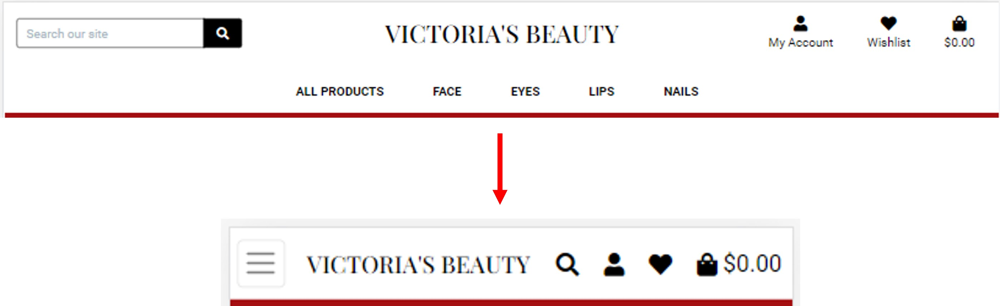

- The *My Account*,  *All Products*, *Face*, *Eyes*, *Lips* and *Nails* buttons have a dropdown menu which is toggled by clicking.

    

- For not logged in users, *My Account* menu displays links only to 2 pages: *Register* and *Login*.
    
    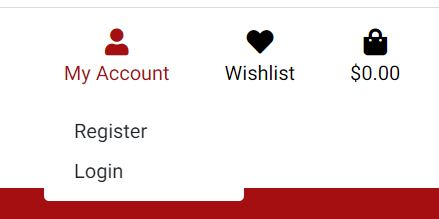

- A logged in user can view the following links: *Product Management*, *My Profile* and *Logout*.
    Buttons *Log In* and *Register* disappear. 

    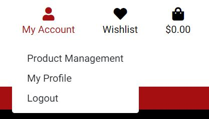

- For small devices, the products menu is displayed as a dropdown menu.

    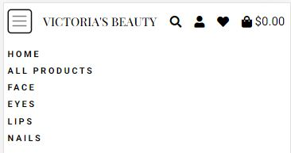

- All buttons of the navbar are clickable and open correct pages.

---

**Pages layout:**

- *Home* page rearranges correctly at certain breakpoints.

    

- *Products* page rearranges correctly at certain breakpoints.

    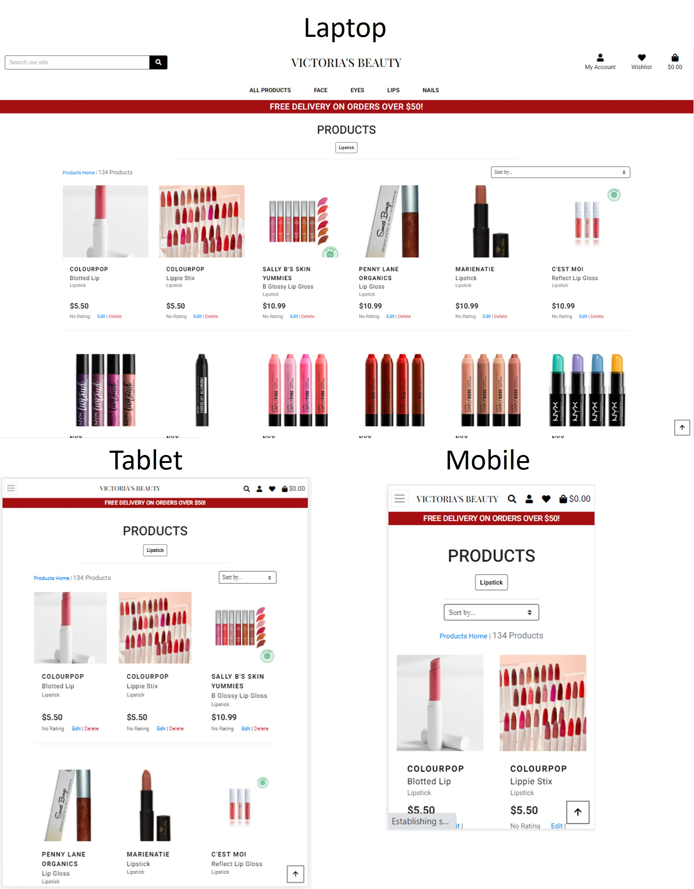

- *Add a product* and *Edit a Product* pages rearrange correctly at certain breakpoints.

    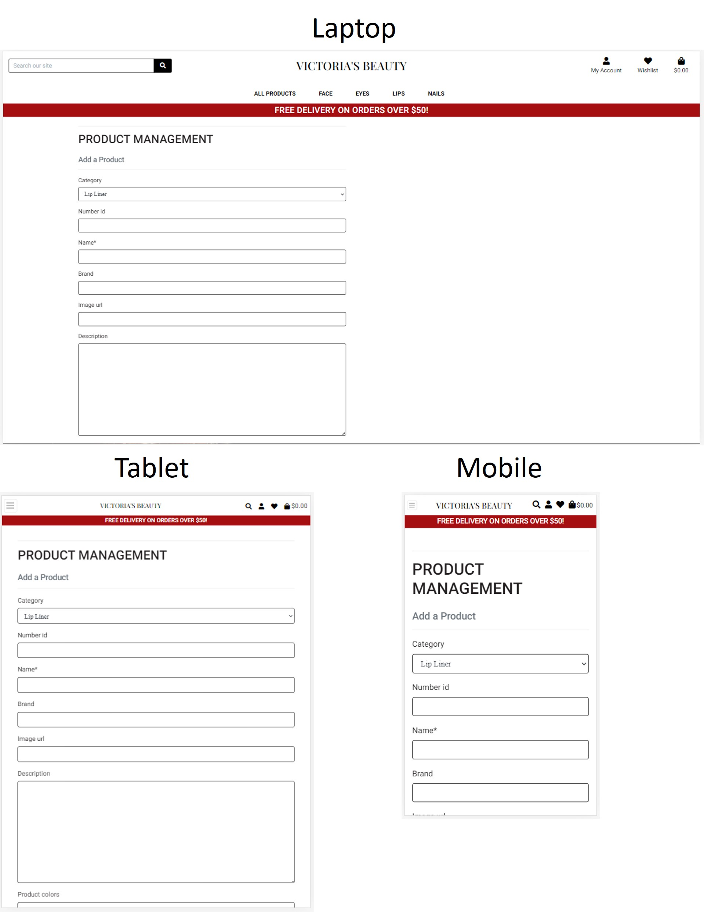

- *Sign Up* and *Sign In* pages rearrange correctly at certain breakpoints.

    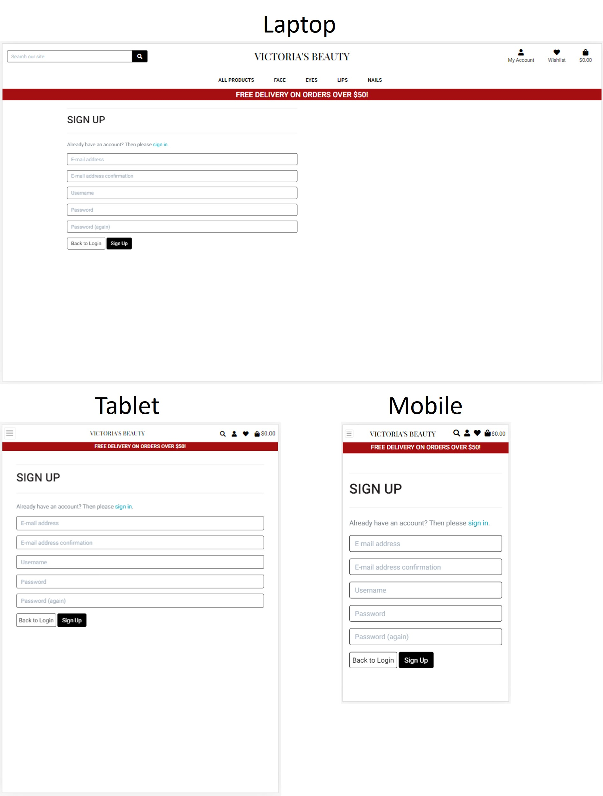

- *Product Details* page rearranges correctly at certain breakpoints.

    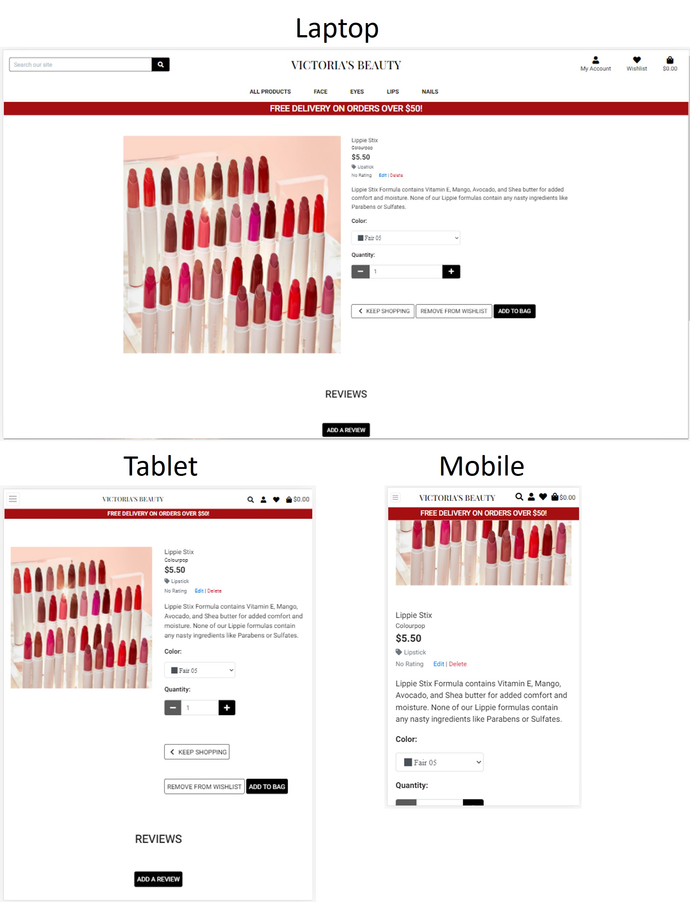

- *Shopping Bag* and *Wishlist* pages rearrange correctly at certain breakpoints.

    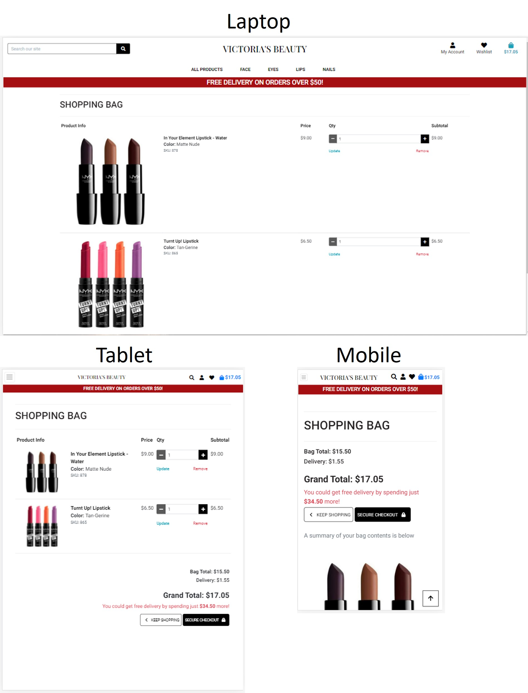

- *My Profile* page rearranges correctly at certain breakpoints.

    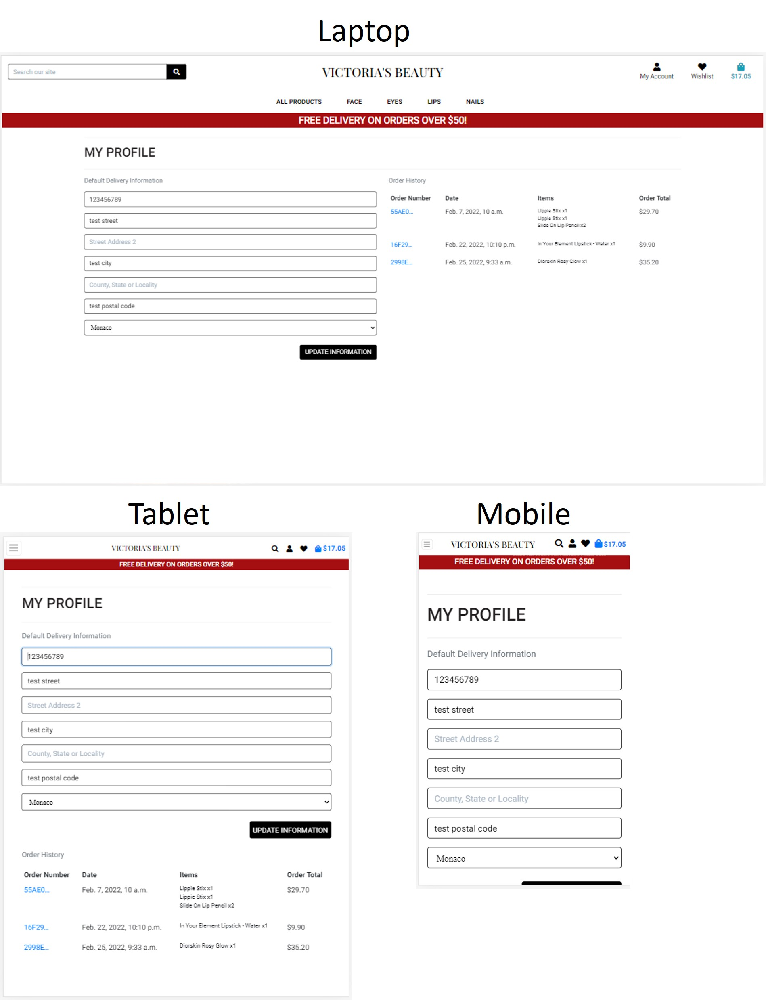

- *Checkout* page rearranges correctly at certain breakpoints.

    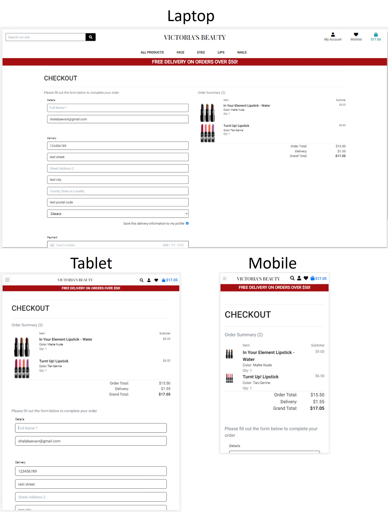

- *Checkout Success* page rearranges correctly at certain breakpoints.

    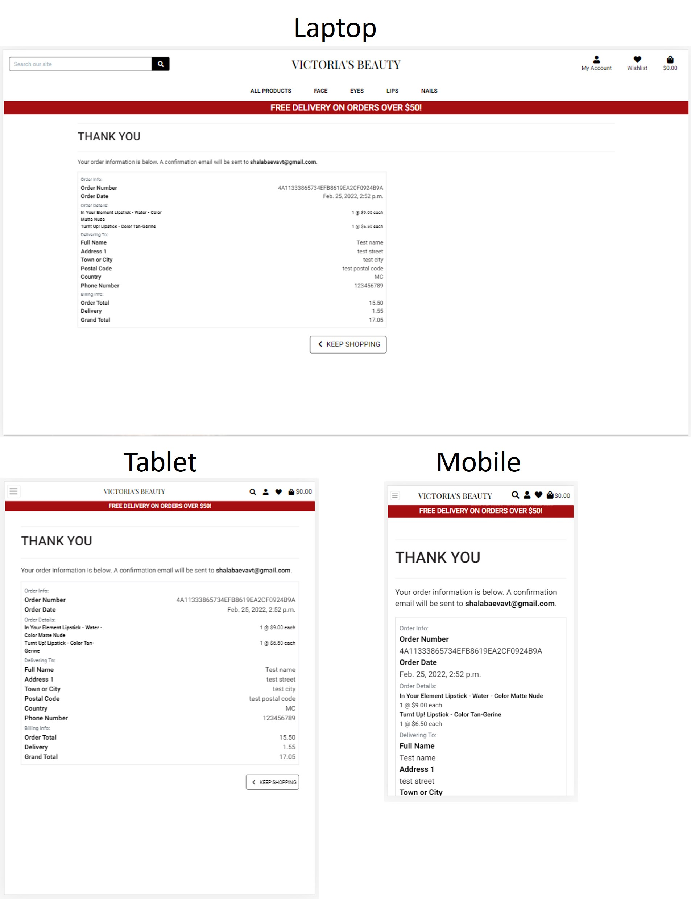

---

***Register*, *Log In* and *Log Out* functionality**

A big part of *Register*, *Log In* and *Log Out* functionality testing is described in the *As a site user* section of [user stories testing](testing_user_stories.md).

Additional testing:

- The password should match a specific pattern. If the input does not match a pattern, a message appears to help users.

    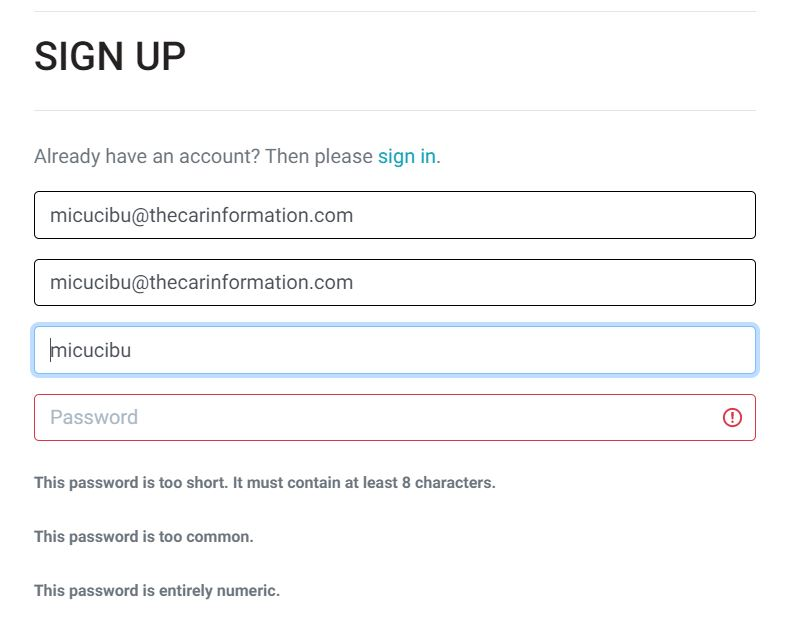

- If the user tries to register an account with the email that was already registered, the warning message appears.

    

- If the user tries to register an account with the username that was already registered, the warning message appears.

    

- If the user, trying to log in, enters an incorrect username or/and password, the warning message appears.

    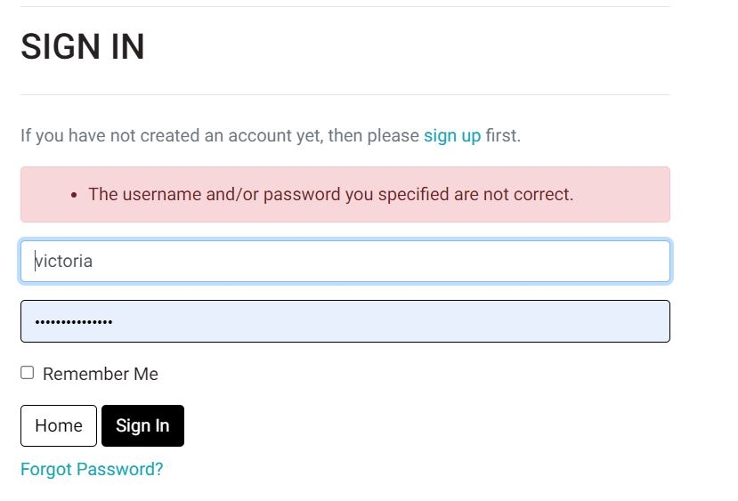
