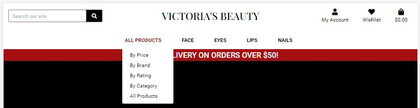

# Testing Functionality, Usability and Responsiveness

Functionality, Usability and Responsiveness of the key website elements were tested manually following the plan:

**Navigation:**

- The navbar automatically collapses at the lg (large) breakpoint (992px).

    

- The *My Account*,  *All Products*, *Face*, *Eyes*, *Lips* and *Nails* buttons have a dropdown menu which is toggled by clicking.

    

- For not logged in users, *My Account* menu displays links only to 2 pages: *Register* and *Login*.
    
    

- A logged in user can view the following links: *Product Management*, *My Profile* and *Logout*.
    Buttons *Log In* and *Register* disappear. 

    

- For small devices, the products menu is displayed as a dropdown menu.

    

- All buttons of the navbar are clickable and open correct pages.

---

**Pages layout:**

- *Home* page rearranges correctly at certain breakpoints.

    

- *Products* page rearranges correctly at certain breakpoints.

    

- *Add a product* and *Edit a Product* pages rearrange correctly at certain breakpoints.

    

- *Sign Up* and *Sign In* pages rearrange correctly at certain breakpoints.

    

- *Product Details* page rearranges correctly at certain breakpoints.

    

- *Shopping Bag* and *Wishlist* pages rearrange correctly at certain breakpoints.

    

- *My Profile* page rearranges correctly at certain breakpoints.

    

- *Checkout* page rearranges correctly at certain breakpoints.

    

- *Checkout Success* page rearranges correctly at certain breakpoints.

    

---

***Register*, *Log In* and *Log Out* functionality**

A big part of *Register*, *Log In* and *Log Out* functionality testing is described in the *As a site user* section of [user stories testing](testing_user_stories.md).

Additional testing:

- The password should match a specific pattern. If the input does not match a pattern, a message appears to help users.

    

- If the user tries to register an account with the email that was already registered, the warning message appears.

    

- If the user tries to register an account with the username that was already registered, the warning message appears.

    

- If the user, trying to log in, enters an incorrect username or/and password, the warning message appears.

    

---

**Admin session funzionality**

Admin session funzionality testing is described in the *As a store owner* section of [user stories testing](testing_user_stories.md).

---

**Search and sorting/filtering functionality**

Search and sorting/filtering functionality is described in the *As a shopper* section of [user stories testing](testing_user_stories.md).

---

**Defensive design**


---

**Further Testing**

- The Website was tested on Google Chrome, Mozilla Firefox and Microsoft Edge browsers.

- The screen sizes and devices tested in Chrome DevTools include:

    - 1920 x 1080 
    - 1600 x 992
    - 1440 x 900
    - 1366 x 768
    - Nexus 10 (800 x 1280)
    - iPad (768 x 1024)
    - Surface Duo (540 x 720)
    - iPhone 6/7/8 Plus (414 x 736)
    - Pixel 2 (411 x 731)
    - iPhone 6/7/8 (375 x 667)
    - Nexus 4 (384 x 640)
    - iPhone X (375 x 812)
    - Galaxy S5 (360 x 640)
    - iPhone 5/SE (320 x 568)

- Devices physically tested include:

  - Desktop 
  - Laptop
  - iPhoneXR 
  - Huawei Mate 20 
    
**Bugs**

### Fixed bugs

1. On the *Shopping bag* page, disabling +/- buttons outside 1-99 range did not work for products who had color names consisting of more than one word. For example, in the image below, one can notice that all products that have one-word color name (or no colors) have a disactivated minus button when the quantity is equal to 1. While products with color names, consisting of several words with spaces between them, have active minus buttons and can go to negative quantity values.

    

    The problem was solved by [cutting](https://docs.djangoproject.com/en/3.2/ref/templates/builtins/#cut) spaces from color names: by substituting `{{ item.color }}` with `{{ item.color|cut:' ' }}` in quantity-form.html.

2. On the *Product details* page, it was not possible to display icons inside select options tag (it was not possible to use an <i> tag):

    ```
    <option value="{{ color.colour_name }}"><i class='fas fa-square-full'></i> {{ color.colour_name }}"</option>
    ```
    The solution was found [Here](https://stackoverflow.com/questions/48508431/how-to-add-font-awesome-icons-in-select-options).

    I have set the font family on the select to font awesome:
    ```
    select {
      font-family: 'FontAwesome'
    }
    ```
    and used character points for the square icon `&#xf45c;`:
    ```
    <option style="color: {{ color.hex_value }};" value="{{ color.colour_name }}">&#xf45c; {{ color.colour_name }}</option>
    ```
    This solution works fine in Google Chrome and Microsoft Edge browser, while in Mozilla Firefox, squared icons are not displayed properly. 

    

### Existing bugs

1. On *Product details* page, in select options tags, the first option displayed text is in grey color. In addition, when color options are opened in a dropdown menu, the text on hover becomes white with blue background. 

    

2. On *Product details* page, the description text for products was not modified/corrected and come from the database in its original state. For some products, the description is too long, can contain list of ingredients, can miss punctuation marks and spaces between different words or can be rendered with html tags. Due to a lack of time, the revision of the text content was left for future improvement. Here is some examples of unappropriate product descriptions:

    

3. In the previous version of the website, it was possible to remove items from a wishlist on the *Product Details* page. When the product was added to a wishlist, the button *Add to Wishlist* became *Remove from Wishlist*.

    
    
Hovewer, if the color of the product was further changed to another color (in the dropdown menu), the button did not turn back to a *Add to wishlist*, but was remaining *Remove from wishlist*. This was posing several problems. First of all, in this case, it was not possible to add several colors of the same product. Secondly, if the color of the product in a dropdown menu was left changed and one would click the *Remove from Wishlist* button (while previously the same product with different color was added) it would give a 500 Service error (which would show very poor user experience). 

It was decided to remove the button *Remove from Wishlist* from *Product Details* page and to choose functionality to add several colors to a wishlist (important feature as then items with specific colors have to be further added to a shopping bag directly from a wishlist). In case a user tries to add exactly the same item (with the same color), a warning message would be displayed. Items can be removed from a wishlist from the *Wishlist* page.

