# Testing User Stories from User Experience (UX) Section

**As a shopper, I want to view a list of products and select some to purchase.**
  
  - A shopper can click the links in the navigation bar or on the button *Shop Now* and be redirected to the corresponding products page. 

    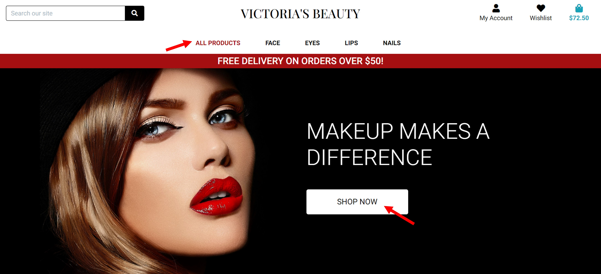
  
  - The *All Products* page display all products available in the webshop. 

    

**As a shopper, I want to view individual products details and identify the price, description, product rating, product image and available colors.** 

  - A shopper can click on the product of interest and be redirected to a *Products Details* page. Here he will find more detailed information on a specific product.

    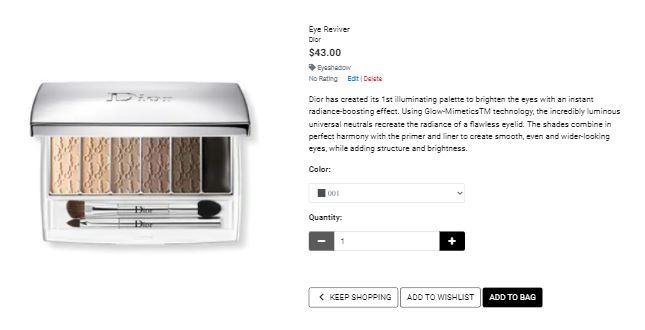

**As a shopper, I want to easily select the color and quantity of a product when purchasing it.**

  - In the *Products Details" page, a shopper can select a color and quantity of each product.

    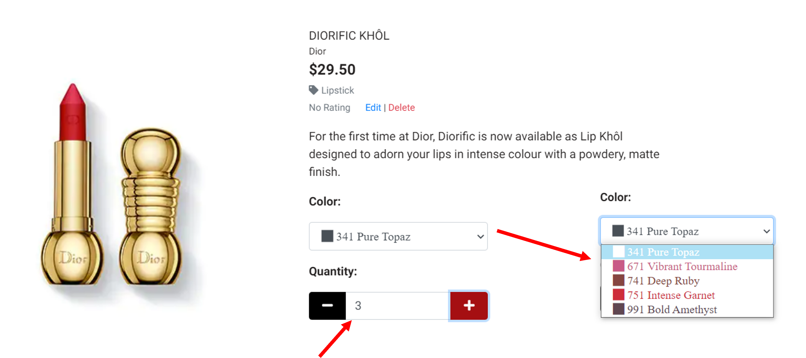

  - The quantity of the product can be further adjusted on the *Shopping Bag* page.

    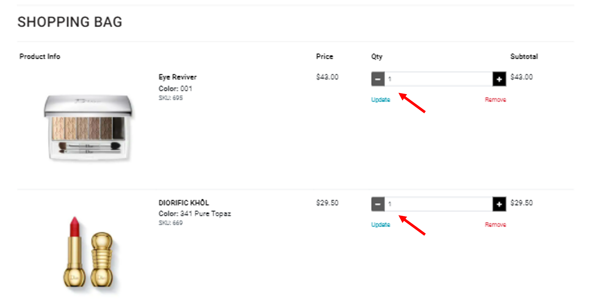

**As a shopper, I want to view reviews left by other customers for products (to understand whether the product is worth purchasing).**

  - Before taking a decision on purchasing any products, a shopper can read reviews on a specific product left by other users."

    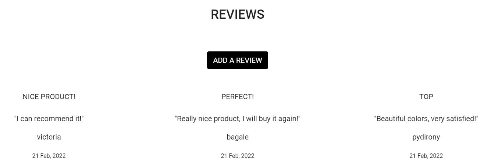

**As a shopper, I want to leave a review on a product, so that other users may be able to benefit from my opinion on a specific product.**

  - On the *Product detailes* page, a shopper can click on a *Add a Review* button to write a review (see image with a *Add a Review* button above). When clicking the button, a shopper can write a review by filling in a form.

    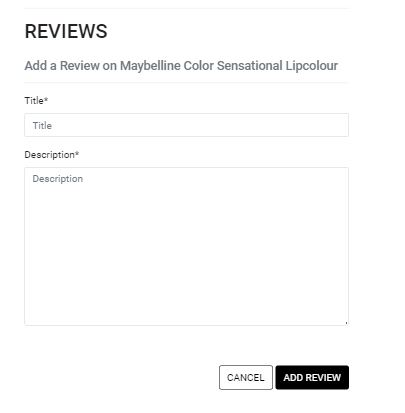

**As a shopper, I want to be able to edit or delete my reviews (in case I change my opinion).**

  - After a review submission, a shopper can edit (or delete) his reviews by clicking on *Edit* (or *Delete*) buttons available at the bottom of each review. Upon clicking on *Edit* button, a shopper is redirected to a *Edit Review* page to resubmite a form. If *Delete* button is clicked, the review is deleted and an info message is shown.

  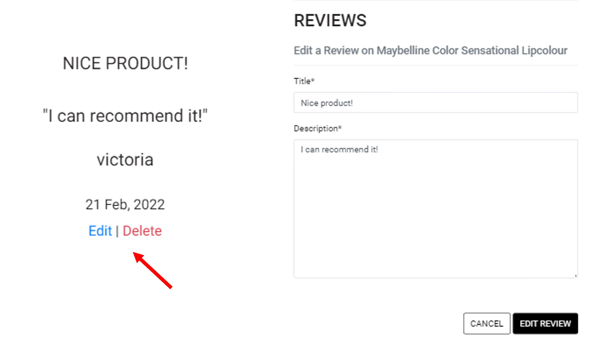

**As a shopper, I want to sort the list of available products and easily identify the best rated, best priced, categorically and brand sorted products.**

  - Products can be sorted from the dropdown menu in the navigation bar.

    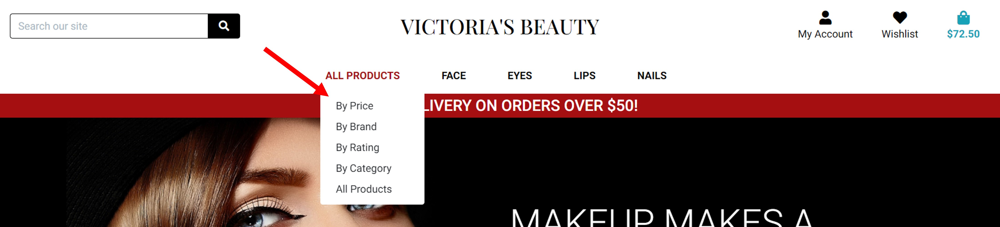

**As a shopper, I want to sort a specific category of products (to find the best priced or best rated products in a specific category, or sort the products in that category by name or brand).**

  - A specific category of products can chosen from the navigation bar and then be further sorted from the filter box.

    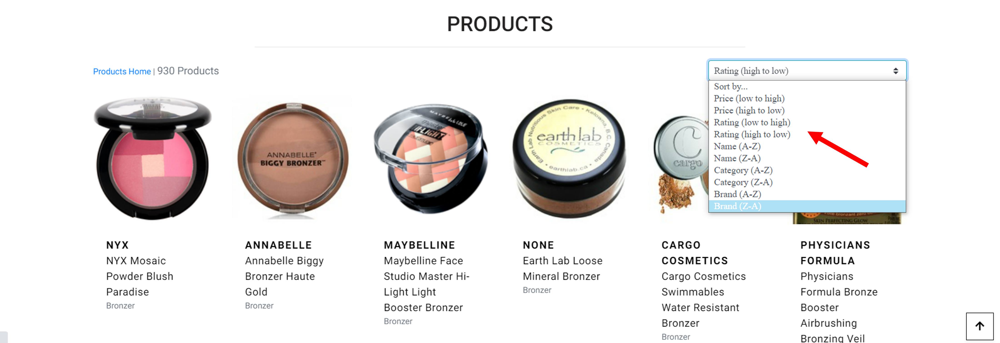

**As a shopper, I want to search by name, brand or description to find a specific product I would like to purchase.**

  - A shopper can search by name, brand or description to find a specific product using a search box on the top of each page.

    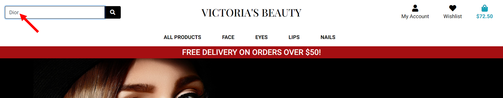

**As a shopper, I want to easily see what I have searched for and the number of results.**

  - A shopper can easily view a number of search results.

    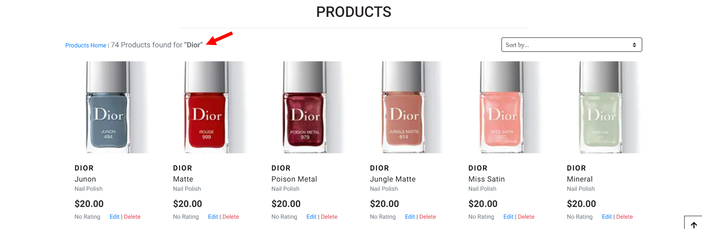

**As a shopper, I want to view items in my bag to be purchased.**

  - The items to be purchased can be viewed on the *Shopping Bag* page. 

    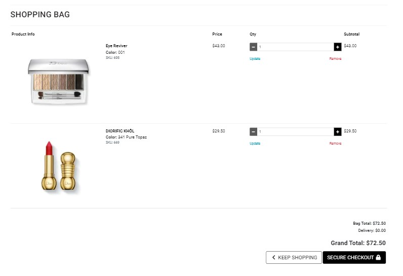
    
  - When a new item is added to a shopping bag, the summary of items can be seen in the info box that appears in the top right corner.

    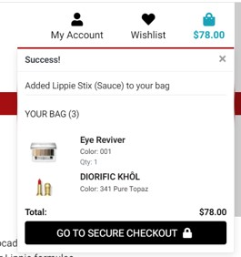

**As a shopper, I want to adjust the quantity of individual items in my bag.**

  - The product quantuty can be adjust on the *Shopping Bag* page (please see image above).

**As a shopper, I want to easily view the total of my purchases at any time to avoid spending too much.**

  - A shopper can view the total of his purchases at the top right corner of each page. 

    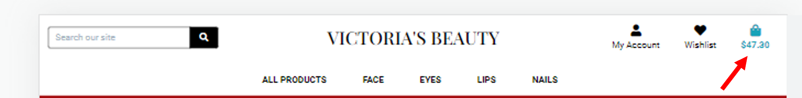

**As a shopper, I want to easily enter my payment information and check out quickly without hassles**

  - A shopper can click on "Secure Checkout" button either from a *Shopping bag* page or from an info window with a shopping bag summery.

    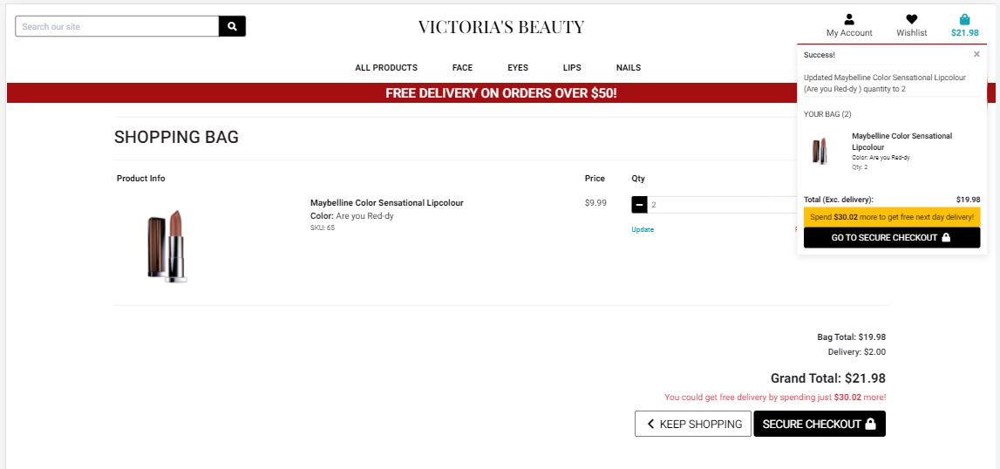

  - On the *Checkout* page a shopper will find a form to fill in a delivery information (if a shopper is logged in, the delivery information will be pre-populated). If the user is not logged in, the order will be processed for an anonymous user. 
  
  - A shopper can view a summery of his order. 

  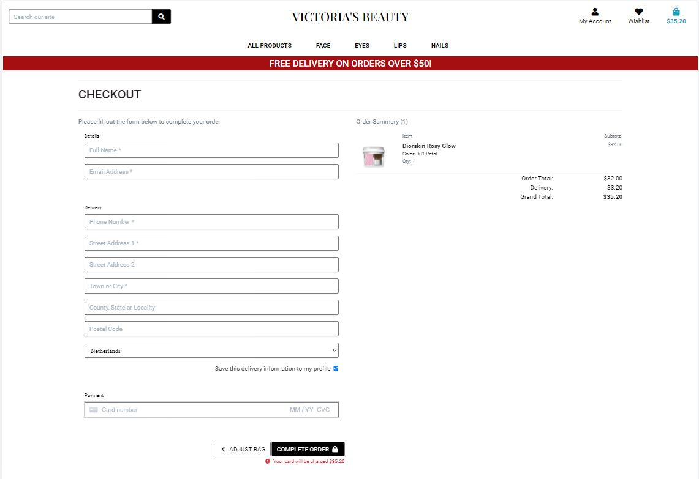
  
  - The payment information is on the bottom of the page, the validation is done via Stripe. Clicking *Complete Order* button will display an overlay with a spinning icon while the payment is processed. 

  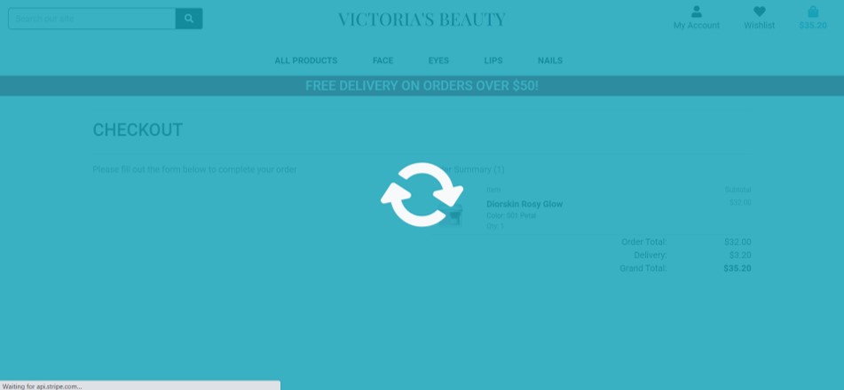

**As a shopper, I want to view an order confirmation after checkout.**

- A user can view the *Checkout Success* page with a success info message on the top right corner of the page, summary of his order and delivery information. A user also receives a confirmation email on his order.

  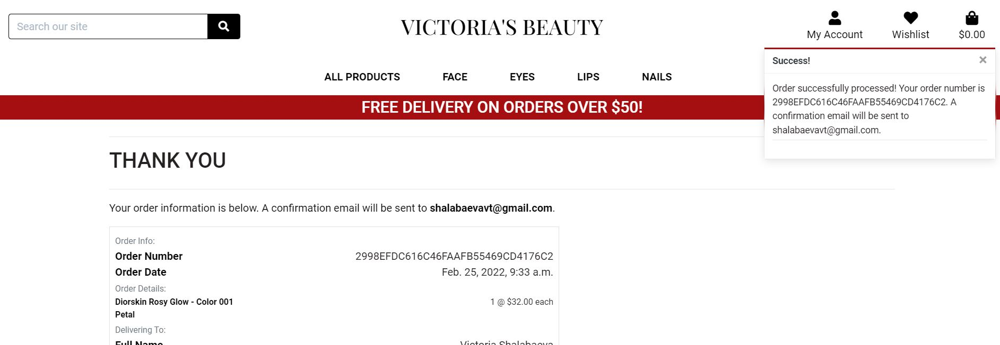

**As a shopper, I want to create my wishlist (to add and remove products).**

- On the *Product Details* page, a logged in user can view a button *Add to Wishlist*. When clicking this button, products are added to the user's wishlist. When products are added to a wishlist the button becomes *Remove from Wishlist*. 

  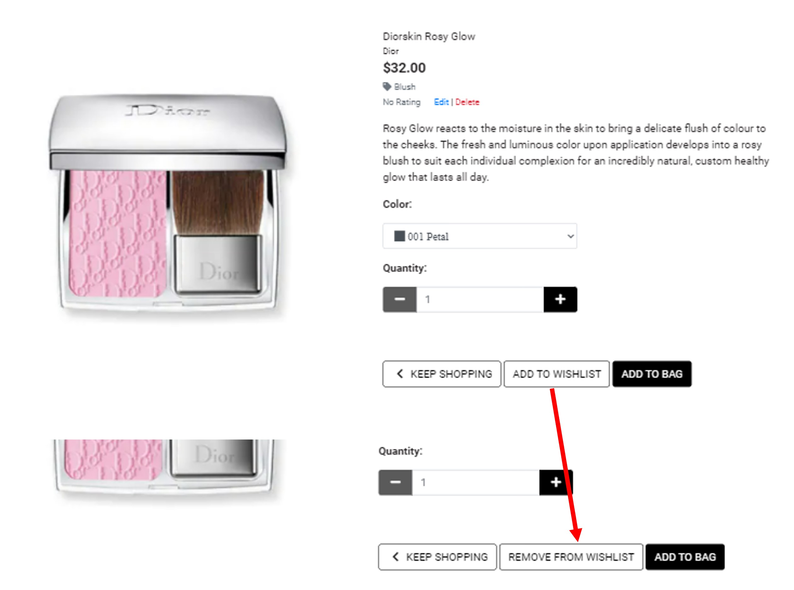

- In order to access a wishlist, a user can click on the *heart* icon on the navigation bar. The page with a wishlist will list all added products. Products can be removed from wishlist also by clicking *Remove* button.

  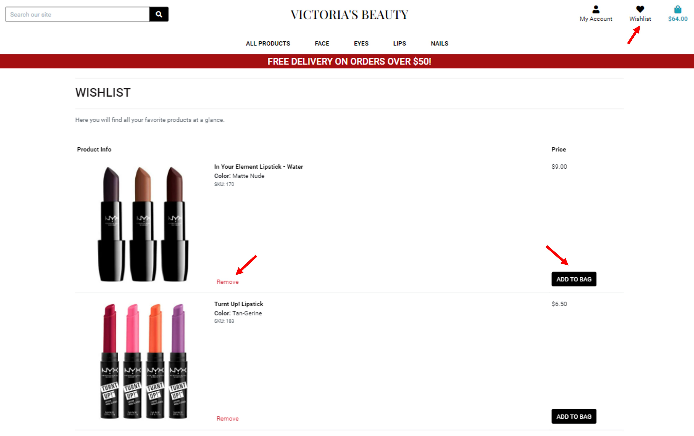

**As a shopper, I want to add items to the shopping bag directly from my wishlist.**

- A user can add items to a shopping bag directly from the *Wishlist* page (see image above).

---

**As a site user, I want to easily register for an account and receive an email confirmation.**

- A user can click on *Register* on *My Account* tab on the navigation bar.

  

- A user can view *Sign Up* page and fill a form.

  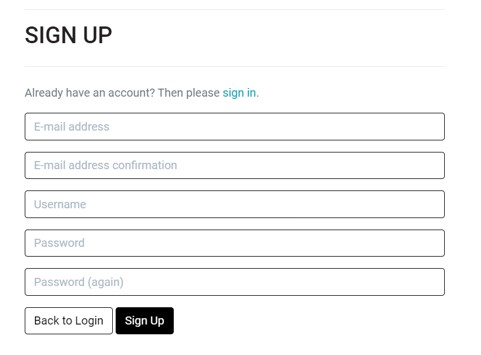

- After form submission, a user will receive a confirmation email.

  

- A user should check his email and open the link to view a *Confirm Email Address* page.

  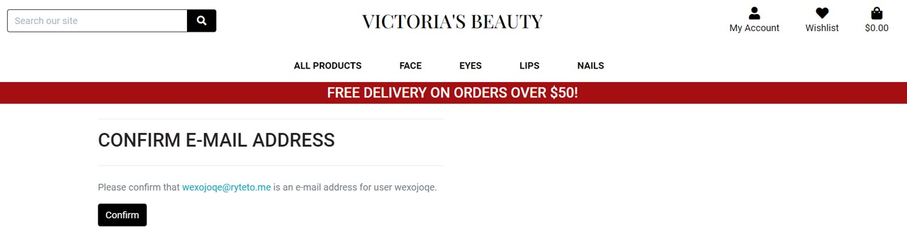

- After a user clicks *Confirm* button, he will be redirected to *Sign In* page and view the sucssess info message.

  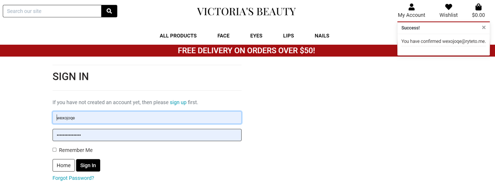

**As a site user, I want to easily login/logout and to view my profile.**

- A user can click on *Login* on *My Account* tab on the navigation bar.

  

- A user can view *Sign In* page and fill a form with his email address and password.

  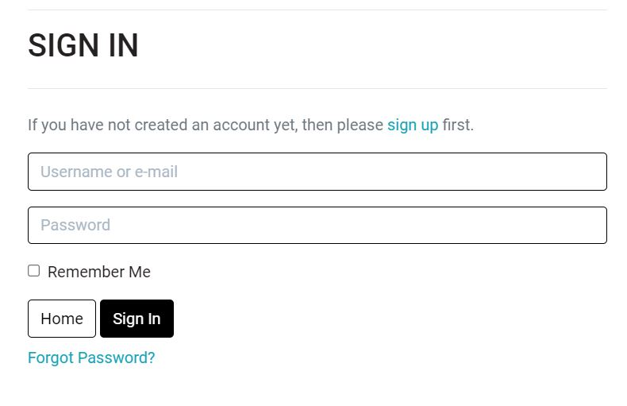

- After signing in, a user is redirected to *My Account* page.

  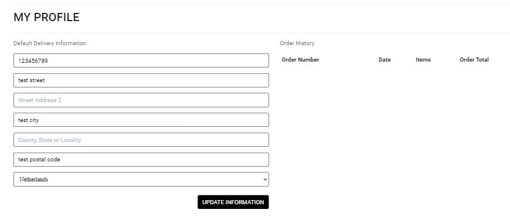

- A user can logout by clicking *Logout* button on *My Account* tab on the navigation bar.

  

- A user can view *Sign Out* page and click *Sign Out*.

  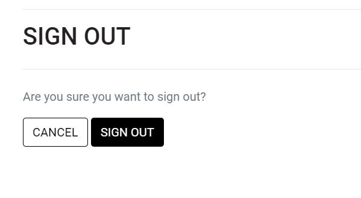  

**As a site user, I want to easily recover my password in case I forget it.**

- On the *Sign In* page, a user can click on *Forgot password* in case he forgot it. 

  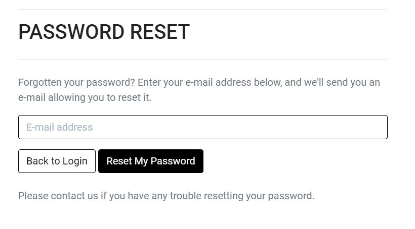 

- After filling in an email address, an email with a link to reset password will be sent.

  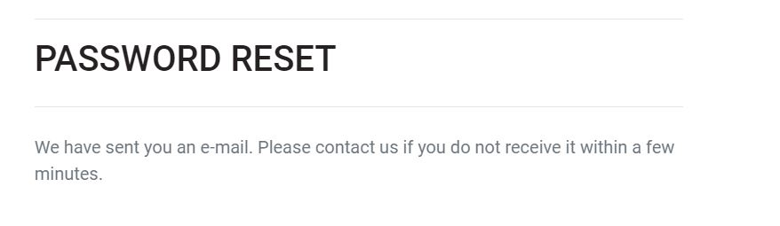 

- After clicking a link received by email, a user is redirected to *Change Password* page.

  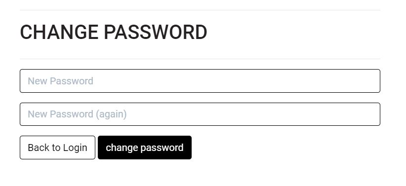 

- After a user has submitted a new password for his accoun, he will view a successful info message. by clicking on *Set Password*, he will be redirected to *Sign In* page.

  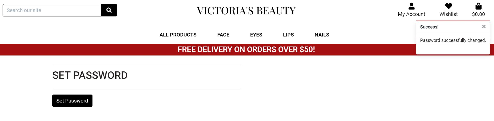 

**As a site user, I want to view my personal order history and save my delivery information.** 

- On *My Profile* page, a user can view his order history and update his delivery information.

  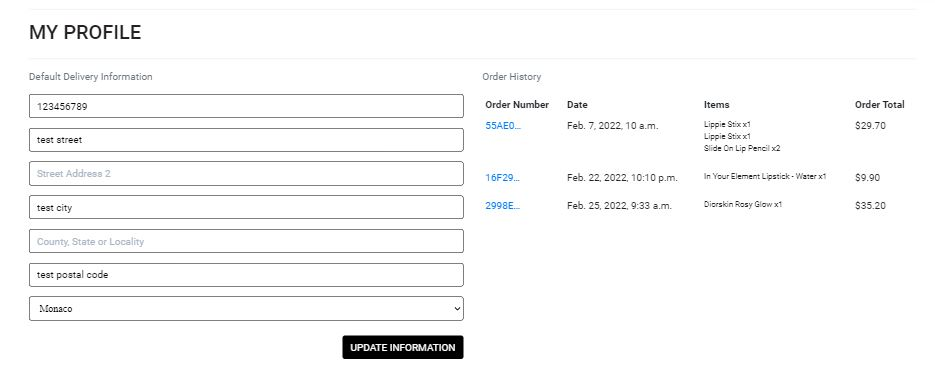

---

**As a store owner, I want to add new items to my store.**
**As a store owner, I want to edit/update products details.**
**As a store owner, I want to delete items that are no longer fore sale.**
**As a store owner, I want the site to be easy to navigate.**
**As a store owner, I want to provide users with updates to any action.**