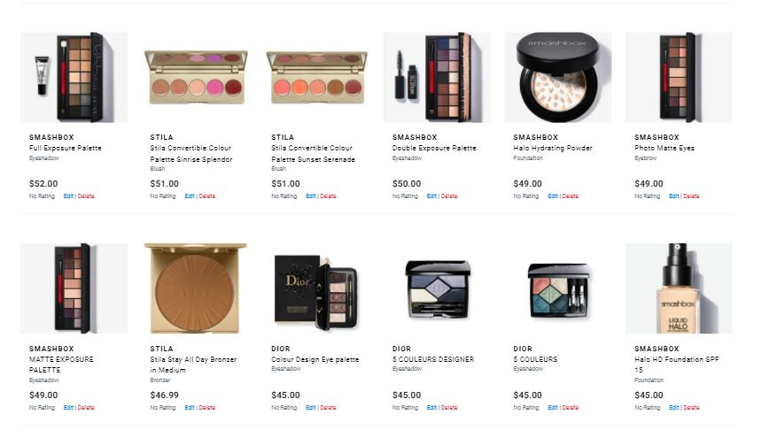

# Testing User Stories from User Experience (UX) Section

## As a shopper, I want to view a list of products and select some to purchase.
  
  - A shopper can click the links in the navigation bar or on the button *Shop Now* and be redirected to the corresponding products page. 

    
  
  - The *All Products* page display all products available in the webshop. 

    

## As a shopper, I want to view individual products details and identify the price, description, product rating, product image and available colors. 

  - A shopper can click on the product of interest and be redirected to a *Products Details* page. Here he will find more detailed information on a specific product.

    

## As a shopper, I want to easily select the color and quantity of a product when purchasing it.

  - In the *Products Details" page, a shopper can select a color and quantity of each product.

    

  - The quantity of the product can be further adjusted on the *Shopping Bag* page.

    

## As a shopper, I want to view reviews left by other customers for products (to understand whether the product is worth purchasing).

  - Before taking a decision on purchasing any products, a shopper can read reviews on a specific product left by other users."

    

## As a shopper, I want to leave a review on a product, so that other users may be able to benefit from my opinion on a specific product.

  - On the *Product detailes* page, a shopper can click on a *Add a Review* button to write a review (see image with a *Add a Review* button above). When clicking the button, a shopper can write a review by filling in a form.

    

## As a shopper, I want to be able to edit or delete my reviews (in case I change my opinion).

  - After a review submission, a shopper can edit (or delete) his reviews by clicking on *Edit* (or *Delete*) buttons available at the bottom of each review. Then, a shopper is redirected to a *Edit Review* page to resubmite a form.

  

## As a shopper, I want to sort the list of available products and easily identify the best rated, best priced, categorically and brand sorted products.

  - Products can be sorted from the dropdown menu in the navigation bar.

    

## As a shopper, I want to sort a specific category of products (to find the best priced or best rated products in a specific category, or sort the products in that category by name or brand).

  - A specific category of products can chosen from the navigation bar and then be further sorted from the filter box.

    

## As a shopper, I want to search by name, brand or description to find a specific product I would like to purchase.

  - A shopper can search by name, brand or description to find a specific product using a search box on the top of each page.

    

## As a shopper, I want to easily see what I have searched for and the number of results.

  - A shopper can easily view a number of search results.

    

## As a shopper, I want to view items in my bag to be purchased.

  - The items to be purchased can be viewed on the *Shopping Bag* page. 

    
    
  - When a new item is added to a shopping bag, the summary of items can be seen in the info box that appears in the top right corner.

    

## As a shopper, I want to adjust the quantity of individual items in my bag.

  - The product quantuty can be adjust on the *Shopping Bag* page (please see image above).

## As a shopper, I want to easily view the total of my purchases at any time to avoid spending too much.

  - A shopper can view the total of his purchases at the top right corner of each page. 

    

## As a shopper, I want to easily enter my payment information and check out quickly without hassles