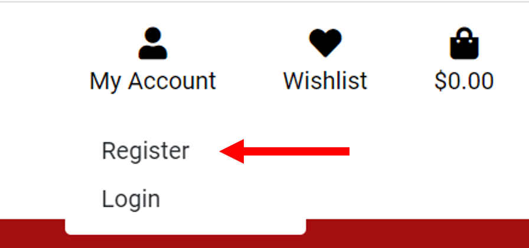
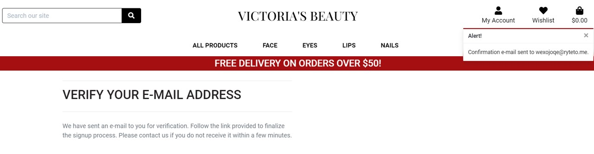

# Testing User Stories

### **As a shopper**:

 **I want to view a list of products and select some to purchase.**
  
  - A shopper can click the links in the navigation bar or on the button *Shop Now* and be redirected to the corresponding products page. 

    
  
  - The *All Products* page display all products available in the webshop. 

    

**I want to view individual products details and identify the price, description, product rating, product image and available colors.** 

  - A shopper can click the product of interest and be redirected to a *Product Details* page. Here he will find more detailed information on a specific product.

    

**I want to easily select the color and quantity of a product when purchasing it.**

  - In the *Product Details* page, a shopper can select a color and quantity of each product.

    

  - The quantity of the product can be further adjusted on the *Shopping Bag* page.

    

**I want to view reviews left by other customers for products (to understand whether the product is worth purchasing).**

  - Before taking a decision on purchasing any product, a shopper can read reviews on a specific product left by other users."

    

**I want to leave a review on a product, so that other users may be able to benefit from my opinion on a specific product.**

  - On the *Product details* page, a shopper can click the *Add a Review* button to write a review (see an image with an *Add a Review* button above). When clicking the button, a shopper can write a review by filling in a form.

    

**I want to be able to edit or delete my reviews (in case I change my opinion).**

  - After a review submission, a shopper can edit (or delete) his reviews by clicking *Edit* (or *Delete*) buttons available at the bottom of each review. Upon clicking the *Edit* button, a shopper is redirected to an *Edit Review* page to resubmit a form. If the *Delete* button is clicked, the review is deleted and an info message is shown.

    

**I want to sort the list of available products and easily identify the best rated, best priced, categorically and brand sorted products.**

  - Products can be sorted from the dropdown menu in the navigation bar.

    

**I want to sort a specific category of products (to find the best priced or best rated products in a specific category, or sort the products in that category by name or brand).**

  - A specific category of products can be chosen from the navigation bar and then be further sorted from the filter box.

    

**I want to search by name, brand or description to find a specific product I would like to purchase.**

  - A shopper can search by name, brand or description to find a specific product using a search box on the top of each page.

    

**I want to easily see what I have searched for and the number of results.**

  - A shopper can easily view a number of search results.

    

**I want to view items in my bag to be purchased.**

  - The items to be purchased can be viewed on the *Shopping Bag* page. 

    
    
  - When a new item is added to a shopping bag, the summary of items can be seen in the info box that appears in the top right corner.

    

**I want to adjust the quantity of individual items in my bag.**

  - The product quantity can be adjusted on the *Shopping Bag* page (please see image above).

**I want to easily view the total of my purchases at any time to avoid spending too much.**

  - A shopper can view the total of his purchases at the top right corner of each page. 

    

**I want to easily enter my payment information and check out quickly without hassles**

  - A shopper can click the "Secure Checkout" button either from a *Shopping bag* page or from an info window with a shopping bag summary.

    

  - On the *Checkout* page a shopper will find a form to fill in a delivery information (if a shopper is logged in, the delivery information will be pre-populated). If the user is not logged in, the order will be processed for an anonymous user. 
  
  - A shopper can view a summery of his order. 

    
  
  - The payment information is on the bottom of the page, the validation is done via Stripe. Clicking the *Complete Order* button will display an overlay with a spinning icon while the payment is processed. 

    

**I want to view an order confirmation after checkout.**

- A user can view the *Checkout Success* page with a success info message on the top right corner of the page, summary of his order and delivery information. A user also receives a confirmation email on his order.

    

**I want to create my wishlist (to add and remove products).**

- On the *Product Details* page, a logged in user can view a button *Add to Wishlist* (not logged in users can't view this button). When clicking this button, products are added to the user's wishlist. 

  

- It is possible to add several colors of the same product to a wishlist.  

    

- If an user tries to add the same item to a wishlist (the same product with the same color), he will see a warning message that the product is already in his wishlist.

  

- In order to access a wishlist, a user can click the *heart* icon on the navigation bar. The page with a wishlist will list all added products. Products can be removed from wishlist by clicking the *Remove* button.

    

- If a not logged in user clicks the heart icon on the navigation bar, he will be redirected to *Sign In* page.

**I want to add items to the shopping bag directly from my wishlist.**

- A user can add items to a shopping bag directly from the *Wishlist* page (see image above).

---

### **As a site user:**

**I want to easily register for an account and receive an email confirmation.**

- A user can click the *Register* on *My Account* tab on the navigation bar.

    

- A user can view *Sign Up* page and fill in a form.

    

- After form submission, a user will receive a confirmation email.

  

- A user should check his email and open the link to view a *Confirm Email Address* page.

    

- After a user clicks the *Confirm* button, he will be redirected to *Sign In* page and view the success info message.

    

**I want to easily login/logout and to view my profile.**

- A user can click the *Login* on *My Account* tab on the navigation bar.

    

- A user can view *Sign In* page and fill a form with his email address and password.

    

- After signing in, a user is redirected to *My Profile* page.

    

- A user can logout by clicking the *Logout* button on *My Account* tab on the navigation bar.

    

- A user can view the *Sign Out* page and click *Sign Out*.

      

**I want to easily recover my password in case I forget it.**

- On the *Sign In* page, a user can click *Forgot password* in case he forgot it. 

     

- After filling in an email address, an email with a link to reset password will be sent.

     

- After clicking a link received by email, a user is redirected to *Change Password* page.

     

- After a user has submitted a new password for his account, he will view a successful info message. by clicking *Set Password*, he will be redirected to *Sign In* page.

     

**I want to view my personal order history and save my delivery information.** 

- On *My Profile* page, a user can view his order history and update his delivery information.

    

---

### **As a store owner:**

**I want to add new items to my store.**

- When logged in as an admin, a user can view an additional link to a *Product Management* page (equivalent to *Add a Product* page) on the *My Account* tab.

    

- A store owner can add a new product by filling in a form.

    

**I want to edit/update products details.**

- A store owner can edit product details by clicking the *Edit* button either from *Products* page or from individual *Product Details* page.

    

- On the *Edit a Product* page, a store owner will see a prefilled form. He can make changes to the fields and save them.

    

**I want to delete items that are no longer for sale.**

- A store owner can delete products by clicking the *Delete* button either from the *Products* page or from individual *Product Details* page. Please see image related to *Edit* button (above).

- When *Delete* button is pressed, a message will appear informing that the product was deleted. It would be useful to implement a popup window with a question whether a store owner is sure to delete a product. This is left as a future feature to apply.

    

**I want to provide users with updates to any action.**

- Whatever action is performed by any user (whether it is a customer or a store owner), the user is always notified with info messages appearing on the right top of the page. The examples of such messages can be seen above in several images throughout the present document.