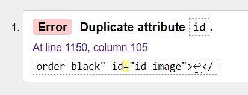
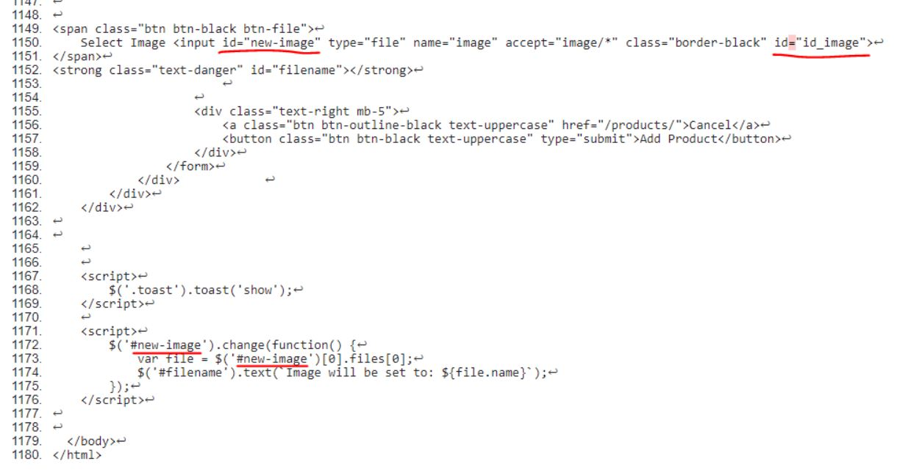
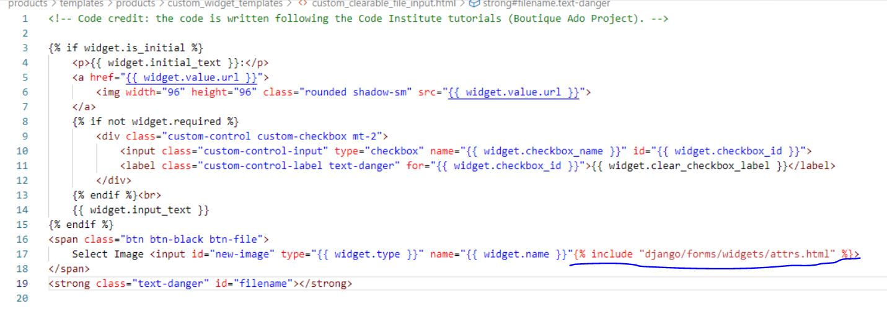
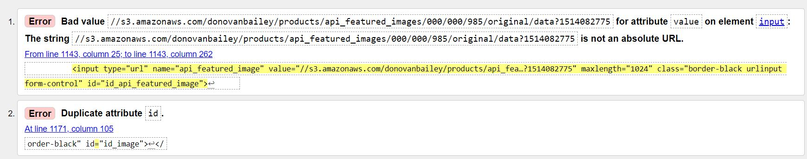
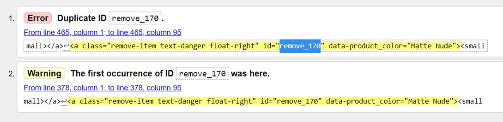

# Testing HTML, CSS, JS and Python code

## [W3C Markup Validator](https://validator.w3.org/) detected the following errors:

  **Add a Product page**
    
  

  In the code below, an input tag has two id attributes: id="new-image" and id="image_id" (see image below). 

  

  id="new-image" is used by a script, while id="image_id" is coming from "django/forms/widgets/attrs.html" (custom widget file).

  

  Considering that I do not have access to id="image_id" (being added automatically by the django/forms), I have tried to change id attribute for "new-image" to a class attribute. However, I have further discovered that "django/forms/widgets/attrs.html" eventually also adds additional classes, which provokes similar error having two class attributes (one added by me for "new-image", another from the widget file). That's why I have decided to leave the html validator error as it is. 

  **Edit a Product page**

  

  Regarding the first error, the form for "Edit a Product* page is prefilled from the database, os the "bad" url is coming from there.The easiest way to resolve this error would be to prepend the URLS in my form with *https:*. Currently I should probably have something like this:
  ```
  <input type="url" name="api_featured_image" value="{{image.url}}">
  ```

  If I change that to:
  ```
  <input type="url" name="api_featured_image" value="https:{{image.url}}">
  ```
  then the url will be correctly formatted in the output and it should pass validation.

  Hovewer, I have checked the files *edit_product.html* and *forms.py*, there are no input fields where I could modify values. It's probably automatically generated by django and the fix won't be straightforward. Secondly, I don't use those information (like "api_featured_image") for rendering the *Product Details* page, that's why I decided to leave the error as it is.

  The second error on *Edit a Product* page is the same one descibed above for *Add a Product* page. 

  **Shopping Bag page**

  

  This is a bug carried over from Boutique Ado course walkthrough project. The same id is coming from desktop and mobile views rendering. Due to lack of time and the fact that there's no easy way to fix that, I have decided to leave it as it is and fix it later.

  **All other page on the website**

  For all other pages in the project, html code passed validation sucssessfully.
  
  

---

## [W3C CSS Validator](https://jigsaw.w3.org/css-validator/) did not detect any problem in the CSS code:

  

---

## [JSHint](https://jshint.com/) did not detect any problem in the JavaScript code.

---

## [PEP8 online](http://pep8online.com/) did not detect any problem in the Python code:

  